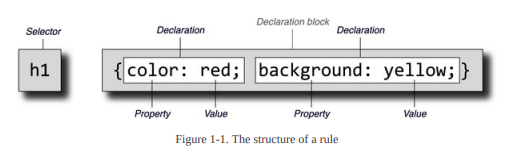

# ALL CSS

Each rule has two fundamental parts: the selector and the declaration block. The declaration
block is composed of one or more declarations, and each declaration is a pairing of a property
and a value. Every stylesheet is made up of a series of these rules

e.g 
