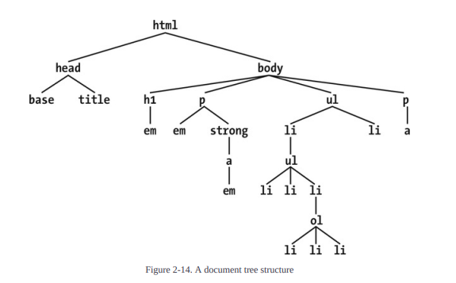

# Selectors

`h2, p {color: gray;}` Seecting elements on the page grouped. comma seperated

These alternatives produce exactly the same result, but one is a lot easier to type:
h1 {color: purple;}
h2 {color: purple;}
h3 {color: purple;}
h4 {color: purple;}
h5 {color: purple;}
h6 {color: purple;}
h1, h2, h3, h4, h5, h6 {color: purple;}

## The universal selector

The universal selector, displayed as an asterisk ( * ), matches any element at all, much like a
wildcard. For example, to make every single element in a document bold, you would write this:
`* {font-weight: bold;}`

`*.warning {font-weight: bold;}` matches any element that has a class warning

p.warning {font-weight: bold;}
The selector now matches any `<p>` elements that have a class attribute containing the word

`.warning.urgent {background: silver;}`
By chaining two class selectors together, you can select only those elements that have both class
names, in any order

## ID Selectors

`*#first-para {font-weight: bold;}` selects all elements with the id of first-para

difference is that a document should have only one instance of a given ID value. If you
find yourself wanting to apply the same ID to multiple elements in a document, make it a class
instead.

## Attribute Selectors

There are four general types
of attribute selectors: simple attribute selectors, exact attribute value selectors, partial-match
attribute value selectors, and leading-value attribute selectors.

If you want to select elements that have a certain attribute, regardless of that attribute’s value,
you can use a simple attribute selector. For example, to select all `<h1>` elements that have a
class attribute with any value and make their text silver, write this:
`h1[class] {color: silver;}`
`h1[class="value"] {color: silver;}` to select a class with spicific value
value must match exaclty e.g `<p class="hello world>`
`p[class="hello"]` wont work
`p[class="hello world"]` will work
This is not equivalent to the dot-class notation
It’s effectively an exact
string match, whereas when using a class selector, the class order doesn’t matter

It is also possible to select elements based on the presence of more than one attribute. You do
this by chaining the attribute selectors together. For example, to boldface the text of any HTML
hyperlink that has both an href and a title attribute, you would write the following:
`a[href][title] {font-weight: bold;}`
`a[href][title="value"] {font-weight: bold;}`

## Selection Based on Partial Attribute Values

Substring matching with attribute selectors
`[foo~="bar"]`
Selects any element with an attribute foo whose value contains the word bar in a space-separated list of words, must be exact match
its like substring turn to array at space
"swiss bobo oba femi" = ["swiss", "bobo", "oba", "femi"] the value must match one of this substrings
e.g
`<h1 class="oba lawal">Hello</h1>`
`[class~="oba"]` will match the above element

## Matching a substring within an attribute value

[foo*="bar"] Selects any element with an attribute foo whose value contains the
substring bar
// this kind of turn the string into an array of substrings and then check if any of the substring contains the specified value
"swiss bobo oba femi" = ["swiss", "bobo", "oba", "femi"] the substring must contain the value
e.g "bo" will match bobo
"iss" will match "swiss"
"femi" will match "femi" or "fem" will still match "femi"
e.g `<h1 class="femioba">Hello</h1>` `<h1 class="obafemi swisbobo">Hello</h1>`
`[class*="oba"]`  both will match because the string contains oba position doesnt matter.

`[foo^="bar"]` Selects any element with an attribute foo whose value begins with bar
this one speaks for itself begin with
`<h1 class="obafemi">Hello</h1>`
`[class^="oba"] {
  color:red;
}`

`<h1 class="obafemi swissbobo">`Hello</h1> wil match
`<h1 class="femi obafemi">`Hello</h1> wont match because no substring its a single string

`[foo$="bar"]` Selects any element with an attribute foo whose value ends with bar //no substring
`[class$="oba"] {
  color:red;
}`
e.g `<h1 class="femi swissoba">Hello</h1>` will match
e.g `<h1 class="femi swissoba ">Hello</h1>` wont match because of space
e.g `<h1 class="femi swissoba keyt">Hello</h1>` wont match because ends with keyt not oba

## `[foo|="bar"]`

`[foo|="bar"]` Selects any element with an attribute foo whose value starts with bar
followed by a hyphen (U+002D) or whose value is exactly equal to bar
e.g
`<h1 class="oba-femi swissbobo">Hello</h1>` will work
`<h1 class="oba- swissbobo">Hello</h1>` will work
`<h1 class="oba">Hello</h1>` will work
`<h1 class="oba swissbobo">Hello</h1>`wont work

## The Case-Insensitivity Identifier

Including an i before the closing bracket of an attribute selector will allow that selector to
match attribute values case-insensitively, regardless of document language rules.

`a[href$='.PDF' i]`

## Using Document Structure



An element is said to be the parent of another element if it appears directly above that element in
the document hierarchy. For example, in Figure 2-14, the first `<p>` element from the left is
parent to the `<em>` and `<strong>` elements, while `<strong>` is parent to an anchor ( `<a>` )
element, which is itself parent to another `<em>` element

## Defining Descendant Selectors

h1 em {color: gray;}
This rule will make gray any text in an `<em>` element that is the descendant of an `<h1>`
element. Other `<em>` text, such as that found in a paragraph or a block quote, will not be
selected by this rule

Each space combinator
can be translated as “found within,” “which is part of,” or “that is a descendant of,” but only if
you read the selector right to left. Thus, h1 em can be translated as, “Any `<em>` element that
is a descendant of an `<h1>` element.”

## Selecting Children >

In some cases, you don’t want to select an arbitrarily descended element. Rather, you want to
narrow your range to select an element that is specifically a child/children of another element. You might,
for example, want to select a `<strong>` element only if it is a child/children (as opposed to any other
level of descendant) of an `<h1>` element. To do this, you use the child combinator, which is the
greater-than symbol ( > ):

`h1 > strong {color: red;}`

This rule will make red the `<strong>` element shown in the first `<h1>` , but not the second:
`<h1>This is <strong>very</strong> important.</h1>`
`<h1>This is <em>really <strong>very</strong></em> important.</h1>`

## Selecting Adjacent-Sibling Elements +

Let’s say you want to style the paragraph immediately after a heading, or give a special margin
to a list that immediately follows a paragraph.

`h1 + p {margin-top: 0;}`

e.g

```html
<p>
  <ol>
    <li>1</li>
    <li>2</li>
    <li>3</li>
  </ol>
  <ul>
    <li>1</li>
    <li>2</li>
    <li>3</li>
  </ul>
</p>

```css
p + ol {
  color: red;
}

ol + ul {
  color:orange;
}


## Selecting Following Siblings ~

h2 ~ ol {

} // this selects any ol that follows h2 and share same parent with h2
e.g will select all the ol
```html 
<div>
    <h2> </h2>
    <ol>
        <li></li>
    </ol>
    <ol>
        <li></li>
    </ol>
    <ol>
        <li></li>   
    </ol>
</div>
